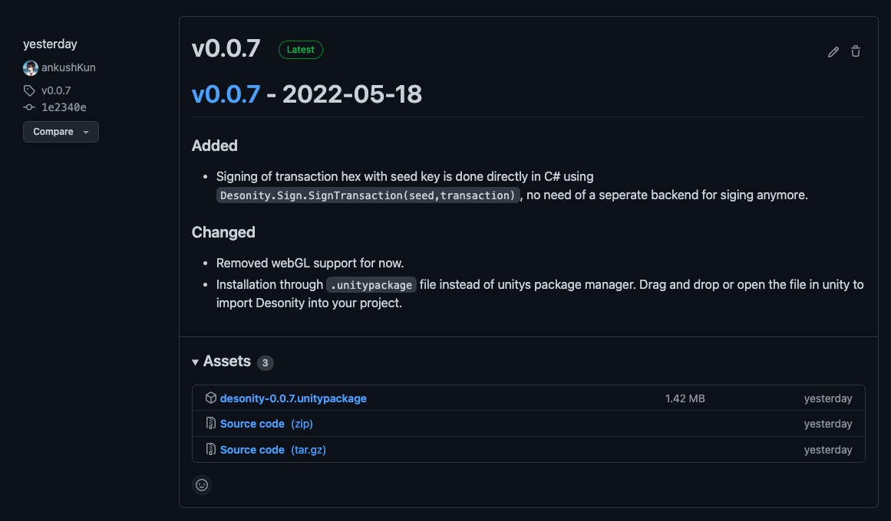

# Introduction

Desonity is a Package for [Unity Game Engine](https://en.wikipedia.org/wiki/Unity_(game_engine)) that allows game developers to integrate the [DeSo Blockchain](https://www.deso.org/) into their games.
  
With Desonity, one can implement features such as NFTs, Creator Coins, DAO Coins, and Social aspects of the Deso Blockchain into their games.

# Installation

<aside class="notice">
This guide assumes you have prior knowledge of the Unity Game Engine and its tools.
</aside>

- Download the latest unitypackage from [releases](https://github.com/Desonity/Desonity/releases)
  
- Open the downloaded unitypackage in unity and import the files.

That's it! You've imported Desonity in your project

<aside class="notice">
If you are have conflicting dependencies for Desonity and your unity project, navigate to `Desonity/Runtime/Plugins` folder and try to manually remove common DLLs (donot delete the newer version of the packages).<br>Info about dependencies used by Desonity can be found <a href="#">here</a>.
</aside>

# Using Desonity

> Since Desonity uses API calls to interact with the DeSo Blockchain, you must use its methods within an async method.

```cs
using UnityEngine;
using Desonity;

public class ExampleCLass : MonoBehaviour
{
    // Start() is an Async function
    async void Start()
    {
        // Do something with Desonity
    }
}
```

To use Desonity you add the Desonity namespace to your script files.

By default various Unity specific functions such as `Start()` donot support Async/Await methods. To get around this Desonity uses [Async Await Support Asset](https://assetstore.unity.com/packages/tools/integration/async-await-support-101056) which can be found in `Desonity/Runtime/Plugins` folder.
